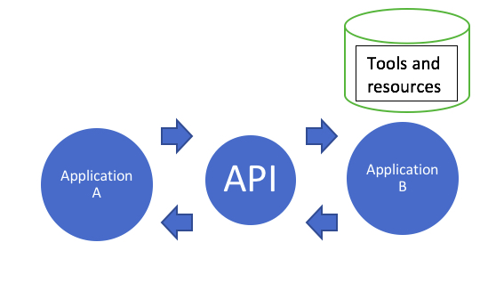
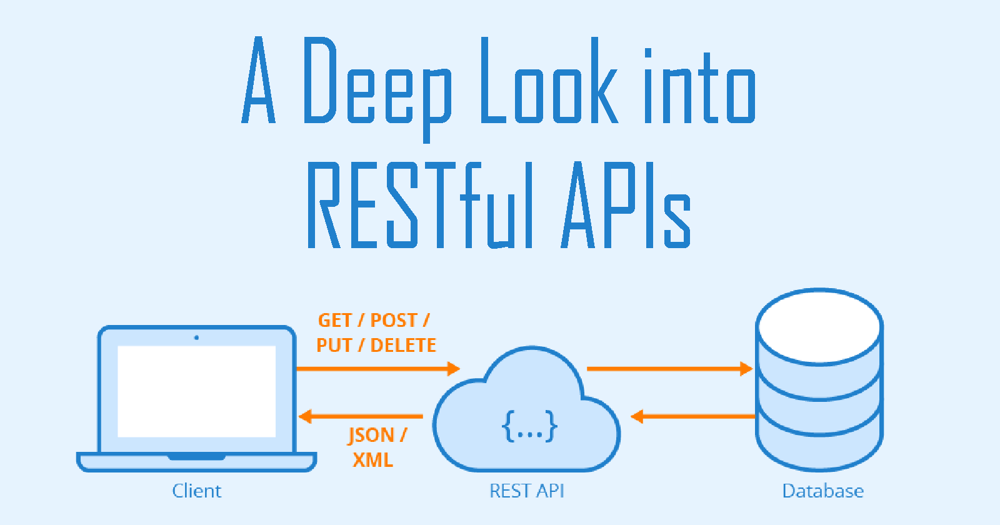
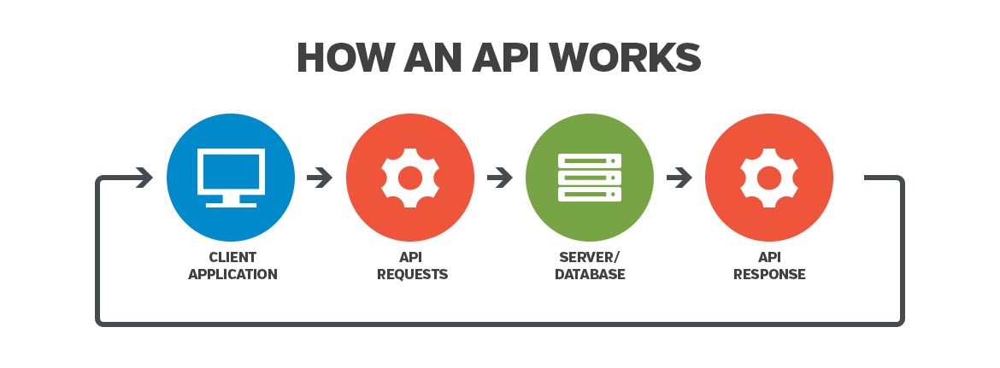

# Tìm hiểu kiến thức cơ bản về API

## API là gì?

Về mặt kỹ thuật, API là viết tắt của Giao diện lập trình ứng dụng (Application Programming Interface).

API là một trung gian phần mềm cho phép hai ứng dụng giao tiếp với nhau, có thể sử dụng cho web-based system, operating system, database system, computer hardware, or software library.

Ở dạng đơn giản nhất, API là giao diện cho phép một ứng dụng giao tiếp với ứng dụng khác thông qua các lệnh đơn giản và cách các lệnh này được gửi và định dạng mà dữ liệu được truy xuất thông qua API có thể khác với API SOAP hoặc REST.

## RESTful API là gì?

**REST** là một dạng chuyển đổi cấu trúc dữ liệu, một kiểu kiến trúc để viết API. Nó sử dụng phương thức HTTP đơn giản để tạo cho giao tiếp giữa các máy. Vì vậy, thay vì sử dụng một URL cho việc xử lý một số thông tin người dùng, REST gửi một yêu cầu HTTP như GET, POST, DELETE … đến một URL để xử lý dữ liệu.

**REST** hoạt động dựa chủ yếu trên phương thức CRUD ( Create, Read, Update, Delete) tương đương với 4 giao thức HTTP: POST, GET, PUT, DELETE.

**RESTful API** là một tiêu chuẩn dùng trong việc thiết kế API cho các ứng dụng Web (như thiết kế Web services), để tiện cho việc quản lý các resource. Nó chú trọng vào resource hệ thống (như: tệp văn bản, ảnh, âm thanh, video, hoặc dữ liệu động…), bao gồm các trạng thái resource được định dạng và được truyền tải qua HTTP.

**REST** là viết tắt của cụm từ **Representational State Transfer** và các ứng dụng sử dụng kiểu thiết kế REST thì được gọi là **RESTful** (-ful là tiếp vị ngữ giống như beauty và beautiful). Tất nhiên bạn cũng có thể sử dụng thuật ngữ REST thay cho RESTful và ngược lại.

## API làm việc như thế nào?

API được xây dựng trên chính 2 thành phần: **Request** và **Reponse**

### Request 

Một cái request đúng chuẩn cần có 4 thứ:

    - **URL**
    - **Method**
    - **Headers**
    - **Body**

  #### 1. URL
  
  Là địa chỉ duy nhất cho 1 request, thường là đường dẫn tới một hàm xử lí logic.

  #### 2. Method

  HTTP request có tất cả **9 loại method** , 2 loại được sử dụng **phổ biến nhất** là **GET** và **POST**

    - **GET**: Sử dụng để lấy thông tin từ server theo URI đã cung cấp.
    - **HEAD**: Giống với GET nhưng response trả về không có body, chỉ có header.
    - **POST**: Gửi thông tin tới sever thông qua các parameters HTTP.
    - **PUT**: Ghi đè tất cả thông tin của đối tượng với những gì được gửi lên.
    - **PATCH**: Ghi đè các thông tin được thay đổi của đối tượng.
    - **DELETE**: Xóa resource trên server.
    - **CONNECT**: Thiết lập một kết nối tới server theo URI.
    - **OPTIONS**: Mô tả các tùy chọn giao tiếp cho resource.
    - **TRACE**: Thực hiện một bài test loop-back theo đường dẫn đến resource.

  #### 3. Headers

  Là nơi chứa các thông tin cần thiết của 1 request nhưng end-users không biết có sự tồn tại của nó. 
  
  Ví dụ: độ dài của request body, thời gian gửi request, loại thiết bị đang sử dụng, loại định dạng cái response mà client có đọc được…

  #### 4. Body

  Là nơi chứa thông tin mà client sẽ điền.

### Response

Sau khi nhận được request từ phía client, server sẽ xử lý cái request đó và gửi ngược lại cho client 1 cái response. Cấu trúc của 1 response tương đối giống phần request nhưng Status code sẽ thay thế cho URL và Method. 

Tóm lại, nó có **cầu trúc 3 phần:**

    - **Status code**
    - **Headers**
    - **Body**: Phần Header và body tương đối giống với request.

  #### Status code

  Status code (Mã hóa trạng thái thường được gọi là mã trạng thái) là một số nguyên 3 ký tự, trong đó ký tự đầu tiên của Status-Code định nghĩa loại Response và hai ký tự cuối không có bất cứ vai trò phân loại nào. 
  
  Có 5 giá trị của ký tự đầu tiên:

    - **1xx: Information (Thông tin)**: Khi nhận được những mã như vậy tức là request đã được server tiếp nhận và quá trình xử lý request đang được tiếp tục.
    - **2xx: Success (Thành công)**: Khi nhận được những mã như vậy tức là request đã được server tiếp nhận, hiểu và xử lý thành công
    - **3xx: Redirection (Chuyển hướng)**: Mã trạng thái này cho biết client cần có thêm action để hoàn thành request
    - **4xx: Client Error (Lỗi Client)**: Nó nghĩa là request chứa cú pháp không chính xác hoặc không được thực hiện.
    - **5xx: Server Error (Lỗi Server)**: Nó nghĩa là Server thất bại với việc thực hiện một request nhìn như có vẻ khả thi.

  #### Ví dụ về request – response trong API

  Khi bạn sử dụng một ứng dụng trên điện thoại di động, ứng dụng kết nối Internet và gửi dữ liệu tới máy chủ. Máy chủ sau đó lấy ra dữ liệu đó, diễn giải nó, thực hiện các hành động cần thiết và gửi nó trở lại điện thoại của bạn. Ứng dụng sau đó giải thích dữ liệu đó và trình bày cho bạn thông tin bạn muốn theo cách có thể đọc được. Đây là những gì một API là – tất cả điều này xảy ra thông qua API.

  Trước khi đến với khái niệm chuyên môn, chúng ta hãy lấy một ví dụ quen thuộc. Hãy tưởng tượng bạn đang ngồi trong nhà hàng và chuẩn bị đặt món. Đầu bếp – “hệ thống” sẽ nấu thức ăn cho bạn. Cái còn thiếu là liên kết giữa bạn và đầu bếp ấy. Bạn không có khả năng biết bếp là khu nào trong nhà hàng để xông thẳng vào và gọi món. Đó là lúc bạn cần đến người phục vụ – API.

  Người bồi bàn này sẽ là người bồi bài, (hay thông thường chúng ta thường gọi là request – yêu cầu) của bạn nói với đầu bếp biết phải làm gì. Người đầu bếp – “hệ thống” biết phải nấu cho bạn cái gì và đưa cho người bồi bàn sau khi đã hoàn thành. Sau đó, người bồi bàn này sẽ mang thứ bạn cần – thức ăn/ thông tin (hay chúng ta hay gọi là response).

### Nguồn

https://www.totolink.vn/article/482-api-la-gi-nhung-dieu-ban-can-biet-ve-api.html

https://viblo.asia/p/co-ban-ve-api-testing-phan-2-RQqKLQmbZ7z

